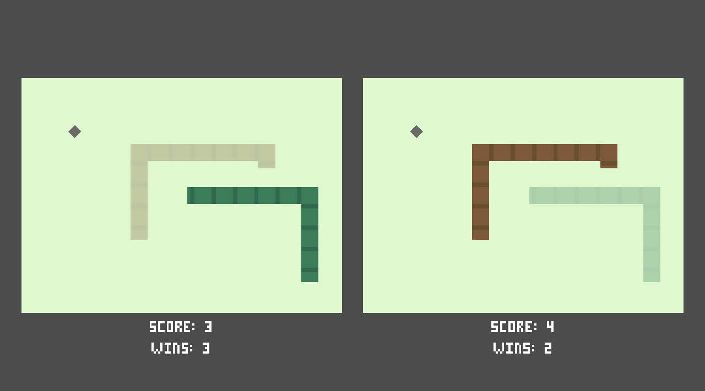

TwoSnakes
=========

A game where two snakes race to collect the most food. The left side
player uses WASD (or ZQSD) while the right side player uses the arrow
keys. Space bar starts the game. To win a round the player has to
survive with the most food collected.

Requires the [Godot Game Engine](https://godotengine.org/) to run.

License
-------

Copyright (C) 2017 Zher Huei Lee <leezh@leezh.me>

This program is free software: you can redistribute it and/or modify
it under the terms of the GNU General Public License as published by
the Free Software Foundation, either version 3 of the License, or
(at your option) any later version.

This program is distributed in the hope that it will be useful,
but WITHOUT ANY WARRANTY; without even the implied warranty of
MERCHANTABILITY or FITNESS FOR A PARTICULAR PURPOSE.  See the
GNU General Public License for more details.

You should have received a copy of the GNU General Public License
along with this program.  If not, see <http://www.gnu.org/licenses/>.

